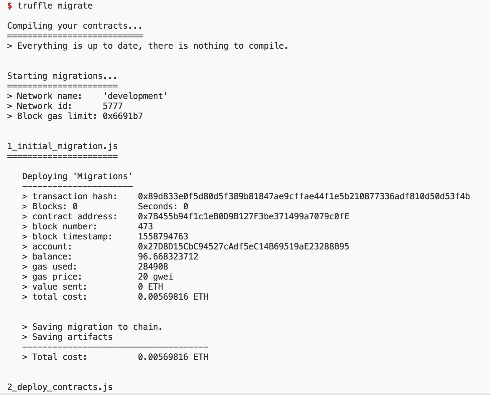
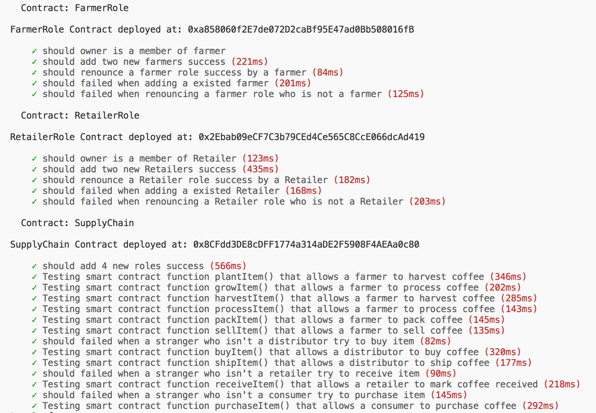
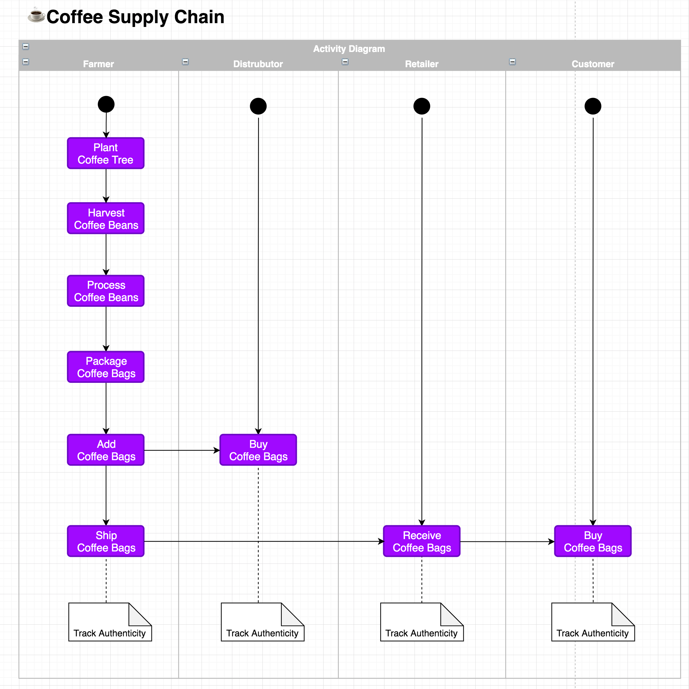
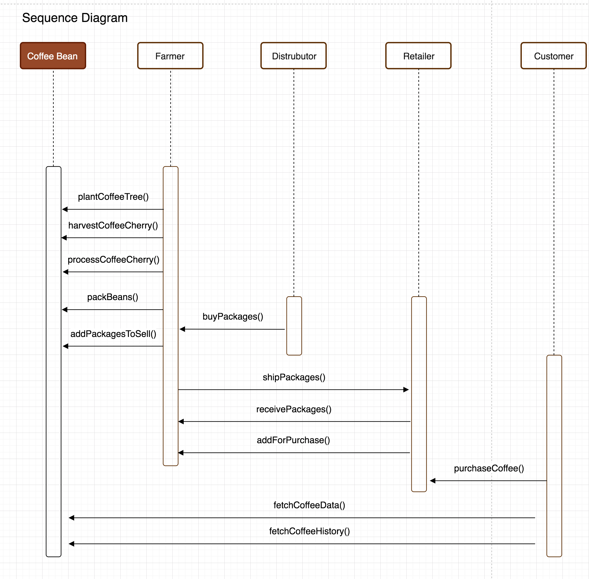

# ☕️Coffee SupplyChain Project Introduction

This repository containts an Ethereum DApp that demonstrates a Coffee Supply Chain flow between a Seller and Buyer. The user story is similar to any commonly used supply chain process. A Seller can add items to the inventory system stored in the blockchain. A Buyer can purchase such items from the inventory system. Additionally a Seller can mark an item as Shipped, and similarly a Buyer can mark an item as Received.

# Getting Started

## Installing
#### Clone this repository:
````
git clone git@github.com:KFGameHacker/CoffeeSupplyChain.git
````
#### install all requisite packages (as listed in package.json):
````
npm install
````

#### Launch Ganache:
````
ganache-cli -m "spirit supply whale amount human item harsh scare congress discover talent hamster"
````
Your terminal should look like this:


#### Using Truffle Framework to compile the contract files
````
truffle compile
````
This will create the smart contract artifacts in folder build\contracts.

Migrate smart contracts to the locally running blockchain, ganache-cli:
````
truffle migrate
````
Your terminal should look something like this:

Test smart contracts:
````
truffle test
````
All 36 tests should passed.

In a separate terminal window, launch the DApp:
````
npm run dev
````
---

# Libraries:

Truffle v5.0.13 (core: 5.0.13)
Solidity v0.5.0 (solc-js)
Node v8.12.0
Web3.js v1.0.0-beta.37
IPFS not used yet

# Contract Info

### Network:

Rinkeby

### Address:

SupplyChain: 0x8daB2373956745C272c03A7983E6Eb5909e59cC5

### Roles:

Owner Address:        0x27D8D15CbC94527cAdf5eC14B69519aE23288B95

Farmer Address:       0xBd3Ff2E3adEd055244d66544c9c059Fa0851Da44

Distributor Address: 0xCe5144391B4aB80668965F2Cc4f2CC102380Ef0A

Retailer Address:      0x460c31107DD048e34971E57DA2F99f659Add4f02

Consumer Address: 0xD37b7B8C62BE2fdDe8dAa9816483AeBDBd356088

# Transaction History

Planted-0xa4ea624265d0b7a82f46c2f5d72e8cf464ddfe6b2357b7194e46796a041dcc4d

Matured-0x6d778d31b184da38de30786d1830d5dd59cf8743aebc74d629822d2f6cc1a9e3

Harvested-0xe4d584d80b48cf121e7c2c0401d337407d220f7fe256dbfbd0a752f7c164c01d

Processed-0xeea835adf79ac1a503c93f41cca9fb124bc4ab41d1be5bf2500a9970a2dc8764

Packed-0x2cac8eb761eae19665f1611e2aaa600d910610c9a4bc7dd34110a69cd196052e

ForSale-0xac22fe8098961b91c915c7fa8d9004ef87d41e4a91ca4253c95e0d29c65ec04a

Sold-0xd260b40638a70609746bb21770f8e7b6c6b5f2b64394b30cd98888c28a550ddd

Shipped-0x090c6f9c1431262966d0f907c7ce83724d8eb1b5f688a8d5b01e1724d1b4a2e3

Received-0x66bd86f6d2d5f7ca072586386fe67327a60af99f8af67c606146cbbad267d75d

Purchased- 0x71e536d1b3dce376ea399f4ee4605f5e9930b7a815e0a55629cceea0ac932efd

---

# UML Design:

### Activity Diagram:



### Sequence Diagram:



### State Diagram:


### Class Diagram:

